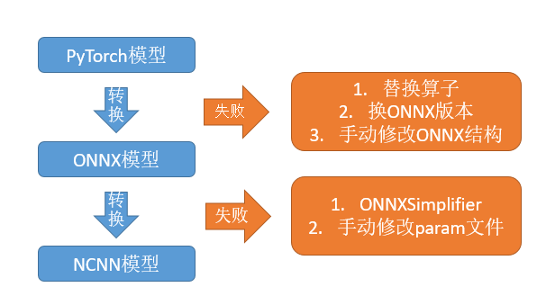

# PyTorch模型的安卓端部署 

## 开发环境选择

1. 本文操作系统为Windows，因为Windows上的安卓模拟器选择较多，并且真机调试也比较方便；

2. 交叉编译在Windows和Ubuntu上都进行了尝试，都可行，但是如果是Ubuntu上交叉编译之后再挪到Windows的话，容易出幺蛾子；

3. 我目前使用的最稳定的工具版本组合是：ndk18、androidstudio4.1、cmake3.10、gradle6.5、MinGW（CodeBlocks自带）。

## 1. PyTorch模型转NCNN

这一小节是介绍如何将自己重新训练过的PyTorch模型转成ncnn，如果没有重训练需求的话，可以直接跳过这一节。


### （1） 整体步骤 

理想情况下，从PyTorch转到ncnn只需要下面两步:

* PyTorch转ONNX

```
torch.onnx._export(model, x, path, opset_version=11) 
```

* ONNX转NCNN

```
./onnx2ncnn model.onnx model.param model.bin 
```

遇到问题的适合解决思路如下：



下面介绍一下我在做ChineseOCRLite中的PSENet模型转换的过程中遇到的问题。

### （2）实际操作的时候可能会遇到各种问题 


#### 问题1： ReLU6不支持

概述：ReLU6算子在转换的时候容易出现不支持的情况，需要使用其他算子替代

解决：使用torch.clamp替代（虽然ReLU6可以通过组合ReLU的方式实现，但是组合得到的ReLU6在NCNN中容易转换失败，不建议使用。）


```
def relu6(x,inplace=True):
  return torch.clamp(x,0,6) 
```

#### 问题2：Resize算子转换问题

概述：因为各个框架对Resize算子的支持都不尽相同，在转换过程中总会出现一些问题，pytorch中的interpolate算子转换成ONNX之后变成很多零散的算子，如cast、shape等，这些在ncnn里面不支持。你可以选择手动修改文件，也可以使用下面这个自动的方法：

解决：使用onnx_simplifier对onnx模型进行简化，可以合并这些零散的算子。

```
python -m onnxsim model.onnx model_sim.onnx 
```

#### 问题3：关于转ONNX及使用onnx_simplifier过程中出现的一系列奇怪问题

概述：使用不同版本的ONNX可能会遇到不同的问题，比如提示conv层无输入等（具体错误名称记不清了）。

解决：下载最新ONNX源码编译安装（onnx_simplifier中出现的一些错误也可以通过安装最新ONNX来解决）

```
git clone https://github.com/onnx/onnx.git
sudo apt-get install protobuf-compiler libprotoc-dev 
cd ONNX 
python setup.py install 
```

#### 问题4：模型输出结果的尺寸固定

概述：直接转换得到的onnx模型的Resize算子都是固定输出尺寸的，无论输入多大的图片都会输出同样大小的特征图，这无疑会影响到模型的精度及灵活性。

解决：修改NCNN模型的param文件，将Resize算子修改成按比例resize。

直接转换得到的param文件中的Interp算子是这样的：

```
Interp    913      1 1 901 913 0=2 1=1.000000e+00 2=1.000000e+00 3=640 4=640 
```
从下面的ncnn源码中可以看到，0代表resize_type，1和2分别是高和宽的缩放比例，3和4分别是输出的高和宽。

```
int Interp::load_param(const ParamDict& pd) 
{
     resize_type = pd.get(0, 0);
     height_scale = pd.get(1, 1.f);
     width_scale = pd.get(2, 1.f);
     output_height = pd.get(3, 0);
     output_width = pd.get(4, 0);
     return 0; 
} 
```

我们只需将其修改成如下格式即可实现按比例resize：

```
Interp      913       1 1 901 913 0=1 1=4.000000e+00 2=4.000000e+00 
```


#### 问题5：NCNN模型输出结果与ONNX模型不同

解决：逐层对比NCNN与onnx模型的输出结果

使用onnxruntime（Python）和NCNN（C++）分别提取每个节点的输出，进行对比。对于ncnn比较简单，可以使用

```
extractor.extract(node_name,preds); 
```

来提取不同节点的输出。

#### 问题5衍生问题1：ONNX没有提供提取中间层输出的方法

解决：给要提取的层添加一个输出节点，代码如下：

```
def find_node_by_name(graph, node_name):
  for node in graph.node:
    if node.output[0] == node_name:
      return node
  return None          

def add_extra_output_node(model,target_node, output_name):
  extra_output = helper.make_empty_tensor_value_info(output_name)
  target_output = target_node.output[0]
  identity_node = helper.make_node("Identity",inputs=[target_output],outputs=[output_name],name=output_name)
  model.graph.node.append(identity_node)
  model.graph.output.append(extra_output)
  return model 
```  
  
修改模型之后再使用
```
out = sess.run([output_name],{"input.1":img.astype(np.float32)}) 
```

就可以获取到模型的中间层输出了。

#### 问题5衍生问题2：发现最后一个Resize层的输出有差异
                      
解决：参考chineseocr_lite里面的代码把mode由bilinear改成了nearest（这里错误的原因可能是wenmuzhou/PSENet.pytorch中的模型最后一个F.interpolate中的align_corners参数设置成了True。据说NCNN只实现了align_corners为False的情况）。

这里修改之后的模型跟原模型之间是会有少许误差的，如果误差不可接受，就要重新训练才行。


## 2. 交叉编译opencv与ncnn 

交叉编译工作可以在windows上进行，使用的是MinGW + cmkae3.10 + AndroidNDK18。可以参考[Windows下编译OpenCV android](https://www.cnblogs.com/zhxmdefj/p/13094954.html)

没有windows C++环境的话，也可以选择在linux上进行。

> 如果是在linux交叉编译，然后复制到windows的话，需要修改一下opencv中cmake配置文件中的路径。

### （1）android ndk下载

最初选择的是r20b，因为和CMake之间的兼容问题，切换到了18b。

```
wget https://dl.google.com/android/repository/android-ndk-r18b-linux-x86_64.zip?hl=zh_cn 
mv android-ndk-r18b-linux-x86_64.zip?hl=zh_cn android-ndk-r18b-linux-x86_64.zip 
unzip android-ndk-r18b-linux-x86_64.zip
```

### （2）编译opencv

利用android中提供的android.toolchain.cmake 工具链可以快速的编译opencv的arm版。

这里选择的arm平台是armeabi-v7a，便于在老旧手机上运行。

```bash
folder="build_arm"
if [[ ! -d "$folder" ]]; then
    echo "$folder not found, creating folder..."
    mkdir build_arm
fi
cd build_arm
cmake \
    -DCMAKE_TOOLCHAIN_FILE=\
    /home/dai/soft/android-ndk-r18b/build/cmake/android.toolchain.cmake \
    -DANDROID_NDK=/home/dai/soft/android-ndk-r18b \
    -DCMAKE_BUILD_TYPE=Release  \
    -DBUILD_ANDROID_PROJECTS=OFF \
    -DBUILD_ANDROID_EXAMPLES=OFF \
    -DANDROID_ABI=armeabi-v7a \
    -DANDROID_NATIVE_API_LEVEL=21  ..
make -j4
```
### （3）编译ncnn 

编译选项参考[ncnn wiki](https://github.com/Tencent/ncnn/wiki/how-to-build#build-for-arm-cortex-a-family-with-cross-compiling)

```
folder="build_arm"
if [[ ! -d "$folder" ]]; then
    echo "$folder not found, creating folder..."
    mkdir build_arm
fi
cd build_arm
cmake \
    -DCMAKE_TOOLCHAIN_FILE=\
    /home/dai/soft/android-ndk-r18b/build/cmake/android.toolchain.cmake \
    -DANDROID_ABI="armeabi-v7a" \
    -DANDROID_ARM_NEON=ON \
    -DANDROID_PLATFORM=android-14 \
    ..
make -j4
```

### （4）chineseocr_lite的PC端测试

与ncnn有关的代码位于ncnn_project目录下。在有opencv和ncnn库的基础上，可以先在pc端跑一下识别代码。

```
cd ncnn_project/ocr
mkdir build_arm 
cd build_arm 
cmake .. 
make -j4
```

编译完成之后 

```
./TextRecognition ../test1.jpg
```

可以看到输出结果:

```
psenet前向时间:0.462291s
psenet decode 时间:0.0604791s
boxzie10
预测结果：
一
统
;名
称
丹正珍
类住
型
有限责
所
中山市
角度检测和文字识别总时间:1.52042s
```

## 3. NCNN模型的安卓端部署

因为代码较长，这一部分只介绍把PC端代码迁移到安卓端的思路，想看详细代码的同学请移步文末的Github地址。

迁移的整体思路如下图所示：


下面一一介绍图中内容

### UI界面

这个demo的UI界面中至少应包含三个元件：

Button——用于选择相册图片

ImageView——用于展示图片及文本检测框

TextView——用于展示识别结果

界面截图如下（TextView在没有文字的时候是不显示的）：


> 界面res/layout/activity_main.xml文件修改。


### Java部分

模型推理是在C++中完成的，Java部分的代码主要是利用安卓的API实现图片读取、文本检测框绘制和结果展示等功能。

需要传入到C++函数的内容包括Bitmap图片和AssetManager对象。

从C++接收到的是一个包含文本框和识别结果的字符串。


### C++部分

C++负责模型推理，推理代码与PC端无异，只是安卓端的文件读取与PC端不同，需要修改文件读取代码，比如crnn的模型加载代码就需要改成下面的样子：

```C++
int model::init(AAssetManager *mgr, const std::string crnn_param, const std::string crnn_bin)
{
    int ret1 = crnn.load_param(mgr, crnn_param.c_str());
    int ret2 = crnn.load_model(mgr, crnn_bin.c_str());
    LOGI("ret1 is %d, ret2 is %d", ret1, ret2);
    return (ret1||ret2);
}
```

另外还需要把Java部分传过来的Bitmap转换成cv::Mat，代码如下：

```C++
// convert bitmap to mat
    int *data = NULL;
    AndroidBitmapInfo info = {0};
    AndroidBitmap_getInfo(env, bitmap, &info);
    AndroidBitmap_lockPixels(env, bitmap, (void **) &data);

    // 这里偷懒只写了RGBA格式的转换
    LOGI("info format RGBA ? %d", info.format == ANDROID_BITMAP_FORMAT_RGBA_8888);
    cv::Mat test(info.height, info.width, CV_8UC4, (char*)data); // RGBA
    cv::Mat img_bgr;
    cvtColor(test, img_bgr, CV_RGBA2BGR);
```

### 最终识别结果

最终得到的demo识别结果如下图所示：


本项目完整代码请移步github：

https://github.com/Arctanxy/DeepLearningDeployment/tree/master/ocr

